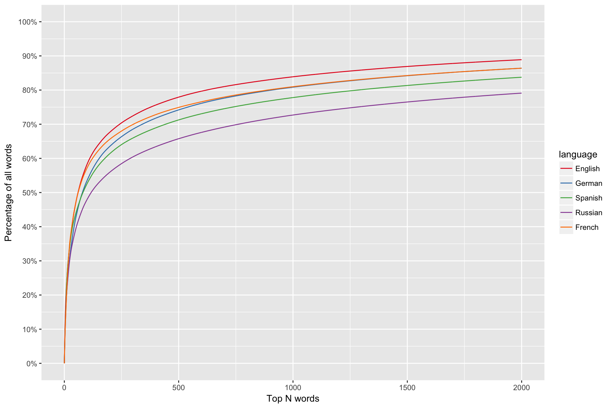
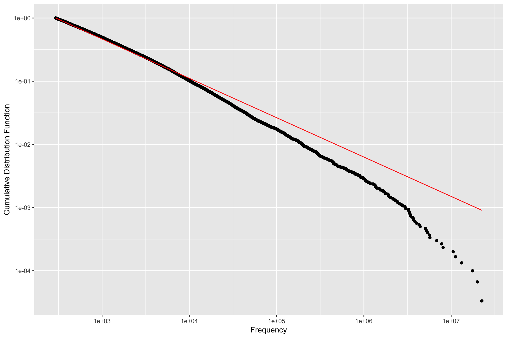
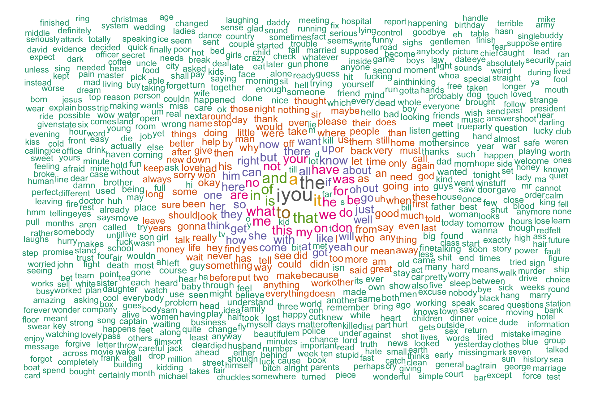

Learning German with Zipf's Law
================

Learning a new language can be a daunting task. However, the word frequencies in many languages follow Zipf's law in that the most frequent word occurs twice as often as the second most frequent, and three times as often as the third, and so on. This means that a relatively small number of words make up the majority of the spoken and written corpus. So you only need to learn 1000 or so words to understand ~85% of common speech and writing.

Here I use subtitles from the TV series Friends to create a list of most frequent German words. Code for this analysis can be found in the [.Rmd file](german.Rmd). First, with code modified slightly from [Tomi Mester](https://hackernoon.com/learning-languages-very-quickly-with-the-help-of-some-very-basic-data-science-cdbf95288333), I convert the subtitle files into a ranked list of words with their word count.

Then we can plot cumulative frequency for the top N words. We can see that you would only have to learn the 500 most frequent words to understand ~77% of all words, 1,000 for ~84%, and 2,000 gets you to almost 90%.

We can test if a discrete power law (Zipf) fits the data well. The red line shows the fitted power law with *α*= 1.8

And what text analysis would be complete without a word cloud, here of the top 1,000 most frequent words. 

You can view the full list with (not necessarily correct!) english translations [here](translated_list.csv).